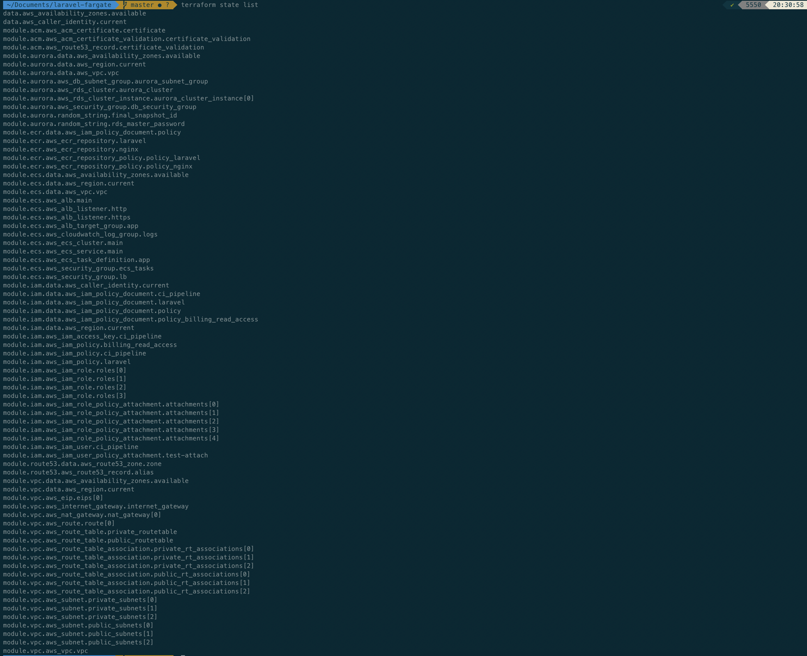
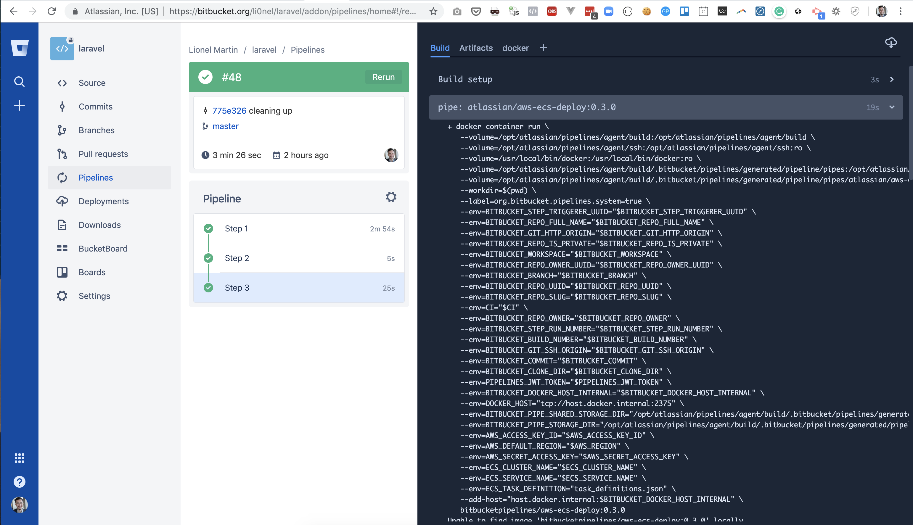

# Deploy Laravel on AWS using Fargate and BitBucket Pipelines


## 1. Create an IAM User for Terraform in the AWS console
...with Programmatic Access only and with the following permissions:

- `arn:aws:iam::aws:policy/AmazonS3FullAccess`
- `arn:aws:iam::aws:policy/AmazonDynamoDBFullAccess`
- `arn:aws:iam::aws:policy/IAMFullAccess`
- `arn:aws:iam::aws:policy/AmazonRoute53FullAccess`
- `arn:aws:iam::aws:policy/AWSCertificateManagerFullAccess`
- `arn:aws:iam::aws:policy/AmazonRDSFullAccess`
- `arn:aws:iam::aws:policy/AmazonEC2FullAccess`
- `arn:aws:iam::aws:policy/AmazonECS_FullAccess`
- `arn:aws:iam::aws:policy/CloudWatchFullAccess`
- `arn:aws:iam::aws:policy/AmazonEC2ContainerRegistryFullAccess`


## 2. Display access keys for the terraform user (do not download!)
```
export PROJECT_NAME=your_project_name_here

export PROJECT_ENVIRONMENT=staging

aws --profile $PROJECT_NAME.$PROJECT_ENVIRONMENT configure
```

Save the below function into your terminal to easily load an AWS profile in a terminal instance (optional):
```
awsprofile() { export AWS_ACCESS_KEY_ID=$(aws --profile $1 configure get aws_access_key_id) && export AWS_SECRET_ACCESS_KEY=$(aws --profile $1 configure get aws_secret_access_key); }

awsprofile $PROJECT_NAME.$PROJECT_ENVIRONMENT
```

## 3. Create your infrastructure using Terraform

### Create and configure an S3 bucket as Terraform's backend
You can use any naming norm for your S3 bucket, as long as you update the backend bucket name configuration in `providers.tf` accordingly.

```
export BUCKET_NAME=$PROJECT_ENVIRONMENT.$PROJECT_NAME.terraform

aws s3 mb s3://$BUCKET_NAME

aws s3api put-bucket-encryption --bucket $BUCKET_NAME --server-side-encryption-configuration '{ "Rules": [ { "ApplyServerSideEncryptionByDefault": { "SSEAlgorithm": "AES256" } } ] }'

aws s3api put-public-access-block --bucket $BUCKET_NAME --public-access-block-configuration BlockPublicAcls=true,IgnorePublicAcls=true,BlockPublicPolicy=true,RestrictPublicBuckets=true

aws s3api put-bucket-versioning --bucket $BUCKET_NAME --versioning-configuration MFADelete=Disabled,Status=Enabled
```

### Create a DynamoDB database for Terraform state locking
```
aws dynamodb create-table --region eu-west-2 --table-name terraform_locks --attribute-definitions AttributeName=LockID,AttributeType=S --key-schema AttributeName=LockID,KeyType=HASH --provisioned-throughput ReadCapacityUnits=1,WriteCapacityUnits=1
```

### Terraform apply
Download this Terraform project as a subfolder in your Laravel project:
```
cd my_laravel_project

git clone git@github.com:li0nel/laravel-on-fargate.git terraform

cd terraform
```

```
export TF_VAR_project_name=$PROJECT_NAME

terraform init

terraform apply
```



### Build and deploy your Docker images manually (optional - only if you don't use BitBucket Pipelines)
```
eval $(aws ecr get-login --registry-ids $(terraform output account_id) --no-include-email)

docker build .. --tag $(terraform output ecr_laravel_repository_uri) && docker push $(terraform output ecr_laravel_repository_uri)

docker build .. -f Dockerfile-nginx --tag $(terraform output ecr_nginx_repository_uri) && docker push $(terraform output ecr_nginx_repository_uri)
```

### SSH tunnelling into the database through the EC2 bastion (optional - only to access the database manually)
```
aws ec2 run-instances --image-id $(terraform output ec2_ami_id) --count 1 --instance-type t2.micro --key-name $(terraform output ec2_key_name) --security-group-ids $(terraform output ec2_security_group_id) --subnet-id $(terraform output ec2_public_subnet_id) --associate-public-ip-address | grep InstanceId

aws ec2 describe-instances --instance-ids xxxx | grep PublicIpAddress
```

```
ssh ubuntu@xxxxx -i $(terraform output ec2_ssh_key_path) -L 3306:$(terraform output aurora_endpoint):3306
```

Then connect using your favourite MySQL client
```
mysql -u$(terraform output aurora_db_username) -p$(terraform output aurora_master_password) -h 127.0.0.1 -D $(terraform output aurora_db_name)
```

```
aws ec2 terminate-instances --instance-ids xxxx
```

## 4. Set up your Laravel Docker configuration

```
curl https://raw.githubusercontent.com/li0nel/laravel-on-fargate/master/Dockerfile > Dockerfile

curl https://raw.githubusercontent.com/li0nel/laravel-on-fargate/master/Dockerfile-nginx > Dockerfile-nginx
```

## 5. Set up your BitBucket Pipelines configuration

```
curl https://raw.githubusercontent.com/li0nel/laravel-on-fargate/master/bitbucket-pipelines.yml > bitbucket-pipelines.yml
```

Then setup the following variables in your BitBucket project's `Settings > Pipelines > Repository variables` from the Terraform output values

- `AWS_ACCOUNT_ID`
- `ECR_LARAVEL_URI`
- `ECR_NGINX_URI`
- `AWS_ACCESS_KEY_ID`
- `AWS_SECRET_ACCESS_KEY`
- `AWS_REGION`
- `ECS_TASK_DEFINITION`
- `ECS_CLUSTER_NAME`
- `ECS_SERVICE_NAME`

That's it.

On the next commit to master, BitBucket Pipelines will build and deploy your Laravel project to your Fargate cluster!



// TODO workers and cron